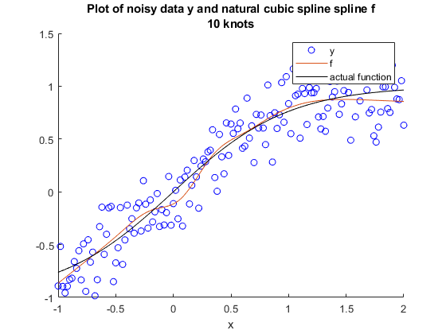
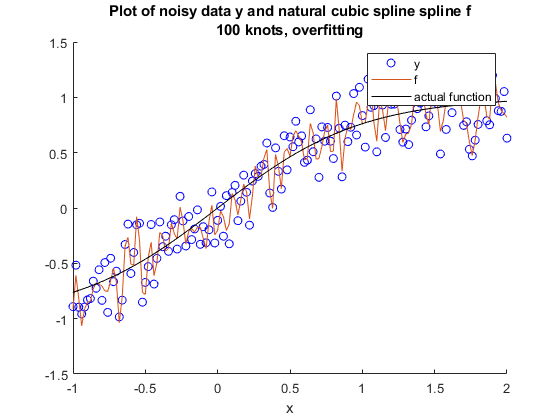
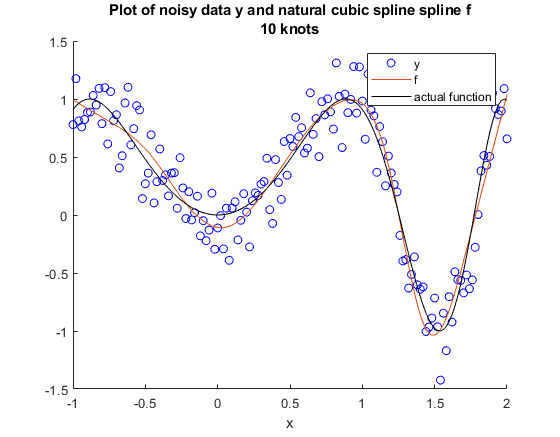
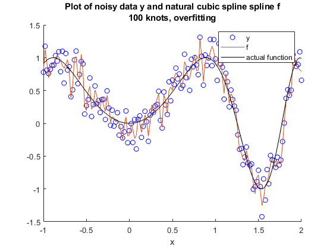

# cubic-spline-matlab
 cubic spline implemented in MATLAB

 To do: generalize to any number of knots
 
 Noisy tanh(x) from x = -1 to x = 2
 ------
 
 5 knot points 
 
 
 
 10 knot points
 
 
 
 100 knot points
 
 
 
 
 Noisy sin(2 x^2) from x = -1 to x = 2. 
 ------
 
 Limited by number of knot points when using 5. Some overfitting at 10.
 
 5 knot points
 
 
 
 10 knot points
 
 
 
 100 knot points
 
 
 
