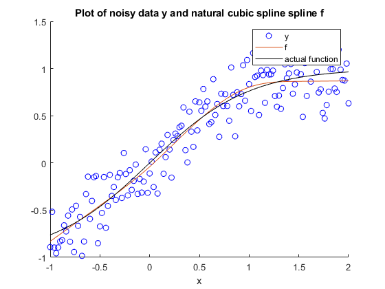
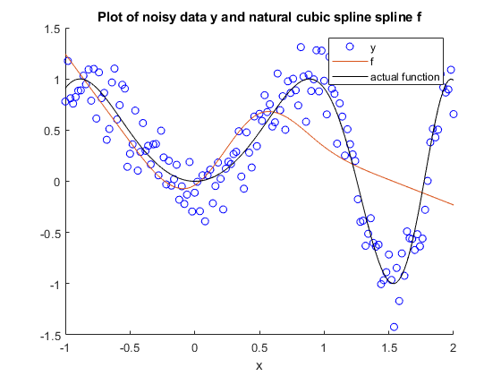

# cubic-spline-matlab
 cubic spline implemented in MATLAB

 To do: generalize to any number of knots
 
 Noisy tanh(x) from x = -1 to x = 2
 
 
 Noise sin(2 x^2) from x = -1 to x = 2
 Limited by number of knot points
 
 